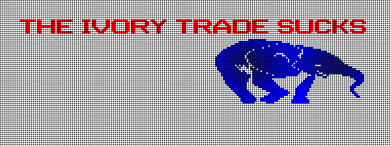

# xstitch

# Introduction / Background
This is a program that can be used to generate an image that sort of looks
like a cross-stitch pattern.  Depending on how poor your eyesight is, it may appear to function correctly.  I wrote it to use in my
Text Me, Troll Me project (to be put online when it's closer to completion).  The idea is based on [Andrew Kleindolph's sms-cross-stitch
project](http://www.extrasleepy.com/#/smscrossstitch/), although his project is much nicer looking.


The `patterns/` directory contains patterns that you can throw together to
create your own image.  All of the non-letter images came from the [ASCII Art
Archive](https://www.asciiart.eu/).  I saved the original in a file called
*shape_name.txt*, and the modified ones for use by my program in *shape_name.xsp*.  Mostly, I just removed author initials, but I also did some minor re-shaping with some of them.

I generated all of the letter patterns using the [figlet](http://www.figlet.org/) program and the [banner3 font](http://www.figlet.org/fontdb_example.cgi?font=banner3.flf) with this bash command:

```
for letter in `echo {A..Z}`; do figlet -f banner3.flf $letter > $letter.xsp; done
```

## Usage
To create the virtual environment and install the required packages, run the
`./create.sh` script.

The script takes four parameters, with an optional fifth:

1. Width of the image
2. Height of the image
3. Number of steps (stitches) across the image
4. Message to display
5. Input image filename (chosen at random if blank)

For example, this command ould produce the following image:

```
$ python main.py 800 300 200 "the ivory trade sucks" --input_filename patterns/baby_elephant.xsp
```


